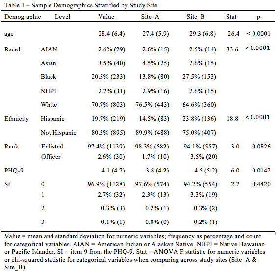

# table1
Creates a Table of Descriptives Suited for MS-Word

I created this package to ease the process of preparing a typical "table 1" as used in medical and social science research. ***Table 1*** generally contains descriptive information for your sample. For integer variables like *age* or numeric variables like *baseline depression* scores, you generally want means and standard deviations. For categorical variables you generally want to know the number and relative percentage of cases within each category.  

Another common feature of Table-1 is stratefication. Perhaps the most common example is two or more groups in a randomized control trial. Other examples might be different recruitment sites, or different disease status. When using stratification, Table 1 usually has a column presenting the summary statistics for each strata.  

It is also very common to conduct statistical tests to determine if demographic variables differ by stratification groups. For integer and numeric variables it is common to use ANOVA, whereas for categorical variables chi-square tests are commonly used.

While R does all of these tasks very easily, what is missing is a convenient way to assemble them into a table that can be exported to Microsoft Word (MS-Word) that doesn't require subtantial editing.

Delow you see to versions of a *Table 1* the first is the output using RMarkdown to MS-Word and the second is the table with manual edits made to conform to a typical journal format.

   
  
.  
And the final version  
.  

  
.  
.  
As you can see, there is minimal editing required to have a final product.  

The primary function in the `table1` package is `buildTable1`, which relies upon `buildTable1Rows`. I have exported `buildTable1Rows` so you can call it directly, although I think in general one would call `buildTable1`. I have tried to make the functions as robust as possible so many errors are detected with helpful error messages, such as **You called `buildTable1Rows` with `groupBy` set to `age` which is not a factor**. See the built in help functions for more details.  
  
  
  
Currently, the package is only available on GitHub and thus you must use Hadley Wickham's devtools package to install it. If you haven't installed that package, begin there (see commented command below in the installation instructions).

## Installation

Development version from github:

```R
# install.packages("devtools") # Uncomment this line if you don't have devtools installed already
devtools::install_github("svannoy/table1", build_vignettes = TRUE)
```
  
  
The file ***table1_markdown_example.Rmd*** in the ***Vignettes*** folder on github provides a demo for building a table.
